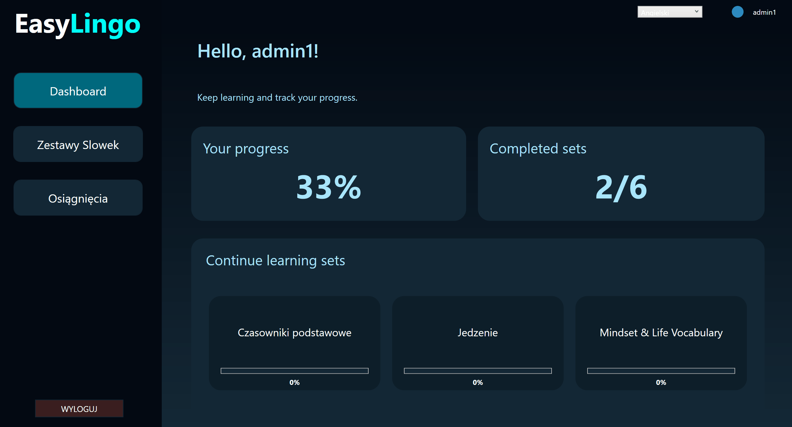
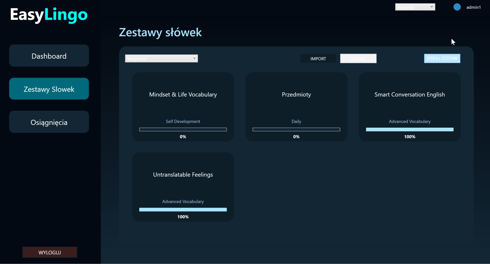

# EasyLingo - Language Learning App

EasyLingo is a desktop application created to support learning foreign languages through vocabulary sets, interactive study modes, and progress tracking.
The project was developed as a university assignment and demonstrates practical use of WPF, MVVM architecture, and database-driven applications.

The application allows multiple users to learn different languages on a single device, with all progress stored locally.

---

## Key Features
- User registration and login
- Multiple languages (dynamic language switching)
- Custom vocabulary sets with categories
- Four study modes:
  - Flashcards
  - Multiple choice quiz
  - Matching pairs
  - Typing translations
- Progress tracking and achievements
- Import and export vocabulary sets using JSON

## Technologies
- .NET (WPF desktop application)
- C#
- Entity Framework Core
- SQLite
- JSON serialization

## Documentation

The project includes full technical and user documentation in both Polish and English, covering:
- application functionality
- architecture overview
- database structure
- JSON import/export format
- user instructions

The documentation is available in the `/docs` directory.

## Application Preview



## JSON Import / Export
Vocabulary sets can be exported to JSON files and imported back into the application.
This enables:
- creating backups
- sharing sets between users
- importing predefined vocabulary collections
The JSON format is versioned and designed for future extensibility.

### Sample data
You can find example JSON files (English-Polish and English-English), that can be imported into the application, in the `/samples` directory.

### Importing / exporting demo



---

## Getting Started
1. Clone the repository:
```powershell
git clone https://github.com/julialuza/EasyLingo/
```
2. Restore tools and create the local SQLite database:
```powershell
dotnet tool restore
dotnet tool install --global dotnet-ef
```
3. Add Migrations
```powershell
cd your_path_to/EasyLingo
dotnet ef migrations add InitialCreate
dotnet ef database update
```

